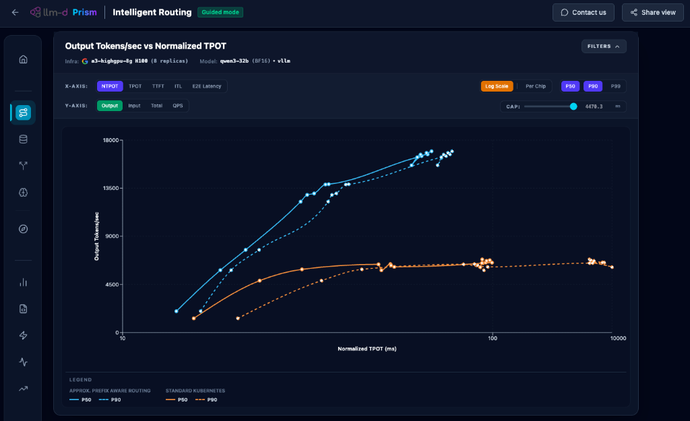

# Prism

[](LICENSE)

> Performance analysis for distributed inference systems

## Overview

AI Platform Engineers and ML Engineers face significant challenges assembling the full end-to-end inference serving stack for their applications, leading to lengthy, manual evaluation cycles, suboptimal performance, and unnecessarily high friction and costs. While many benchmarks and tools exist, the data is often scattered across disconnected docs, spreadsheets, or vendor-specific sites.

Prism helps you choose, configure and optimize the right AI inference infrastructure by unifying benchmark data from disparate sources—cloud APIs, public repositories, and local experiments—into a single interactive analysis experience. Prism makes it easier to navigate the complex trade-offs between throughput, latency cost, and quality with data grounded in validated benchmarks.

<p align="center">
  <picture>
    <source media="(prefers-color-scheme: dark)">
    
  </picture>
</p>

## Technology Stack

- **Framework:** React 19 (via Vite)
- **Styling:** Vanilla CSS (Tailwind CSS v4 for utility-first components)
- **Charts:** Recharts
- **Icons:** Lucide React
- **Language:** JavaScript (ESNext)
- **Cloud:** Google Cloud (GCS, GIQ), AWS (S3)

## Development

See [CONTRIBUTING.md](CONTRIBUTING.md) for general development guidelines, coding standards, and how to submit changes.

## Setup & Deployment

### Local Development

1.  **Install Dependencies**:
    ```bash
    npm install
    ```
2.  **Start Dev Environment**:

    ```bash
    npm run dev
    ```

    - This starts BOTH the backend (port 3000) and frontend (port 5173) concurrently.
    - Dashboard: http://localhost:5173
    - _Note: Ensure you have Application Default Credentials (ADC) set up locally._

3.  **Test Shared Configuration**:
    ```bash
    DEFAULT_PROJECTS="my-google-project-id" npm start
    ```

### Docker Dev Environment (with Docker Compose)

The development environment can be managed using Docker Compose, which mounts the source code and configures Application Default Credentials (ADC) automatically:

1. **Start the Stack**:

   ```bash
   docker compose up -d
   ```

   This starts both the backend (port 3000) and frontend (port 5173, mapped to 8081 on host) with Hot Module Replacement (HMR).

2. **Access the Dashboard**:
   - Dashboard: http://localhost:8081
   - Backend API: http://localhost:3000

3. **Logs**: To view server logs, use:
   ```bash
   docker compose logs -f
   ```

### Cloud Deployment (Google Cloud Run)

The application is deployed to Google Cloud Run using the `deploy.sh` script. This script handles API enablement, configuration persistence, and the deployment command itself.

#### Usage

```bash
./deploy.sh [options]
```

#### Options

| Alternative | Option                  | Description                                                                                    |
| :---------- | :---------------------- | :--------------------------------------------------------------------------------------------- |
| `-f`        | `--config <FILE>`       | **Config File**. Path to the deployment configuration file. Defaults to `.deploy_config`.      |
| `-p`        | `--project <ID>`        | **GCP Project ID**. Defaults to the current `gcloud` project.                                  |
| `-s`        | `--service <NAME>`      | **Cloud Run Service Name**. Defaults to `prism`.                                               |
| `-n`        | `--name <TEXT> `        | **Site Name** (e.g., "Internal", "Stage"). Appears in the browser tab and header.              |
| `-g`        | `--ga-id <ID>`          | **Google Analytics Tracking ID** (e.g., `G-XXXX`).                                             |
| `-c`        | `--contact <URL/Email>` | **Contact Us Link**. Supports URLs or email addresses (automatically prefixed with `mailto:`). |

#### Configuration Persistence

The script saves the most recent deployment configuration to a `.deploy_config` file in the root directory. Subsequent runs will use these values as defaults unless overridden by command-line arguments.

#### Example

To deploy using a specific configuration file (e.g., public release):

```bash
./deploy.sh --config .deploy_config.public
```

To deploy to a specific project with a custom name and contact email:

```bash
./deploy.sh --project my-project-id --name "Prototype" --contact "support@example.com"
```

#### Shared Defaults (Environment Variables)

The following environment variables can be set via `--set-env-vars` in the `gcloud run deploy` command (the script handles this via the arguments above):

- **`SITE_NAME`**: Custom text appended to "Prism".
- **`CONTACT_US_URL`**: URL or email for the support link.
- **`DEFAULT_PROJECTS`**: Comma-separated list of Project IDs for GIQ data.
- **`DEFAULT_BUCKETS`**: Comma-separated list of GCS buckets for results.
- **`DEFAULT_S3_BUCKETS`**: Comma-separated list of public AWS S3 buckets.
- **`GOOGLE_API_KEY`**: API Key for Google Drive/Sheets (auto-detected from `.env.local` if present).

#### Automated Deployment with GitHub Actions

For automatic deployment on push to `main` branch, see [GitHub Actions Setup Guide](docs/github-actions-setup.md).

The workflow uses Workload Identity Federation for secure, keyless authentication and automatically deploys using GitHub repository variables (plus a secret for `GOOGLE_API_KEY`).

## Multi-Cloud Deployment (AWS, Azure, On-Prem)

Note: Deployment on other clouds is a work in progress and requires testing.

This application can be deployed to any container platform (AWS App Runner, Azure Container Apps, ECS, Kubernetes).

1.  **Build Docker Image**:

    ```bash
    docker build -t prism .
    ```

2.  **Authentication**: The application requires Google Cloud credentials to interface with GCS/GIQ -- which are optional.
    - **Create a Service Account Key**: Generate a JSON key for a Service Account with `roles/storage.objectViewer` and `roles/serviceusage.serviceUsageConsumer`.
    - **Mount Key**: Mount this JSON file into the container (e.g., at `/app/credentials.json`).
    - **Set Env Var**: Set `GOOGLE_APPLICATION_CREDENTIALS=/app/credentials.json`.

3.  **Run**:
    ```bash
    docker run -p 8080:8080 \
      -e PORT=8080 \
      -e GOOGLE_APPLICATION_CREDENTIALS=/app/credentials.json \
      -v $(pwd)/credentials.json:/app/credentials.json \
      prism
    ```

### Google Cloud APIs

To deploy the application and authenticate with the Google Cloud APIs, follow these steps:

1.  **Install Google Cloud SDK**: Follow the instructions [here](https://cloud.google.com/sdk/docs/install) to install the `gcloud` CLI.
2.  **Authenticate**:
    ```bash
    gcloud auth login
    ```
3.  **Set Project**:
    ```bash
    gcloud config set project <project id>
    ```
4.  **Set Quota Project** (Critical for ADC to work correctly):
    ```bash
    gcloud config set billing/quota_project <project id>
    ```
5.  **Generate Application Default Credentials**:
    ```bash
    gcloud auth application-default login
    ```

## Architecture

The application uses a **Backend-for-Frontend (BFF)** architecture to simplify security and configuration:

- **Frontend (React)**: Fetches shared configuration from `/api/config` on startup.
- **Backend (Node.js/Express)**:
  - Serves the static React application.
  - Proxies requests to Google Cloud APIs, automatically injecting **Application Default Credentials (ADC)**.
  - Enforces Rate Limiting to prevent abuse.

## Configuration

### Dependency Management

The project uses a standard `.npmrc` to enforce the public npm registry (`https://registry.npmjs.org/`) to ensure consistency for all developers.

## Standard/Public Environment (Default)

- Just run `npm install`. The project `.npmrc` will direct you to the public registry.

## Work/Private Environment

- To use your private registry mirror (e.g., `us-npm.pkg.dev`), run install with the registry config overridden:
  ```bash
  npm_config_registry=https://us-npm.pkg.dev/artifact-foundry-prod/ah-3p-staging-npm/ npm install
  ```
- **Crucial**: Do not commit changes to `package-lock.json` that result from this command if they change the `resolved` URLs back to the private registry. Using `npm ci` is recommended if you just want to install without modifying the lockfile.

# Developer Guidelines

- **Running Locally:** Run `npm run dev`.
- **Parsing Logic:** Data ingestion logic resides in `src/utils/dataParser.js` and files specific to the data source.
  - **Hardware Metadata:** The parser extracts `accelerator` (e.g., `tpu7x`) and configuration details (tensor parallel size, backend) from `manifest.yaml` when available in GCS/S3 sources.
  - **Source Identification:** Benchmarks are tagged with standardized IDs: `infperf` (inference-perf (deprecated)), `quality_scores` (Model Quality), `llm-d-results:google_drive` / `llmd_drive` (DRIVE), and `brv02:<run-uid>` (local Benchmark Report v0.2 uploads).
- **Local Benchmark Reports:** Users can upload `benchmark_report_v0.2,_*.yaml` files produced by [llm-d-benchmark](https://github.com/llm-d/llm-d-benchmark) directly in the browser via the **Connections → Local Benchmark Reports** panel. Uploaded runs appear in both the main scatter chart and a dedicated full-width comparison view (bar charts + metric table with % diffs). Parser: `src/utils/benchmarkReportV02Parser.js`. UI: `src/components/DataConnections/BenchmarkReportPanel.jsx` and `src/components/BenchmarkComparisonDashboard.jsx`. State lives in `useDashboardData` under the `brv02*` prefix.
- **Visuals:** Prioritize intuitive and interactive aesthetics. Use dark mode, glassmorphism, and smooth transitions.
- **Data handling:**
  - `facetCounts` in `Dashboard.jsx` calculates unique configurations for filter dropdowns.
  - `getEffectiveTp` in `Dashboard.jsx` handles inconsistent TP naming (metadata vs model name).
  - **Source Selection**: `Dashboard.jsx` implements strict filtering for data sources. Only sources explicitly permitted by `defaultState` (or user interaction) are enabled.
  - **Active Connection Sorting**: When a data connection is enabled, it is automatically sorted to the bottom of the active list in the Data Connections panel for better UX navigation.

## Contributing

We welcome contributions! Please see [CONTRIBUTING.md](CONTRIBUTING.md) for guidelines.

All commits must be signed off (DCO). See [PR_SIGNOFF.md](PR_SIGNOFF.md) for instructions.

## Security

To report a security vulnerability, please see [SECURITY.md](SECURITY.md).

## License

This project is licensed under the Apache License 2.0 - see [LICENSE](LICENSE) for details.
