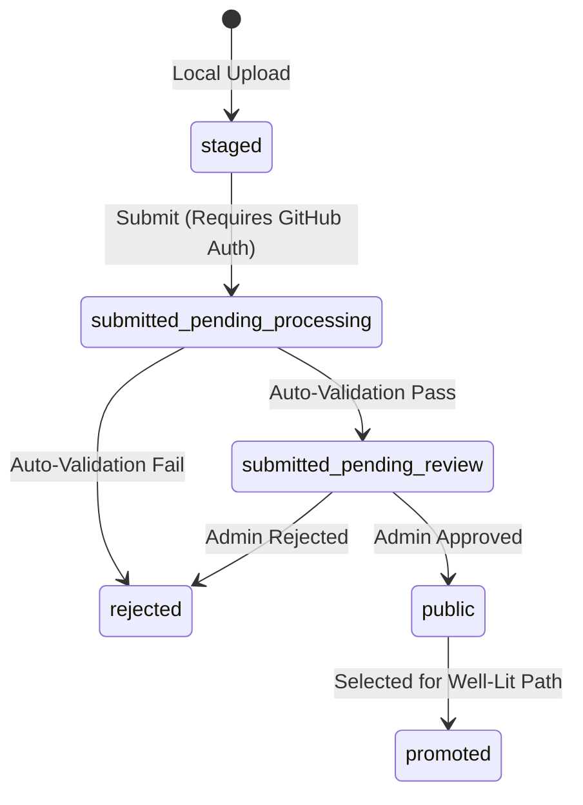

# Prism Cloud Benchmark Upload API Schema & Reference

This document serves as the **source of truth** for the **internal Prism
database format** and upload payload object structure.

> [!IMPORTANT]
>
> **Prism internal schema differs from raw BRV0.2**: This schema is optimized
> for Prism backend storage, indexing, and querying. It does not directly mirror
> the raw output format of upstream `llm-d-benchmark` reports (e.g., hardware
> accelerator definitions may be mapped differently).

Both frontend client state-building/editing components and backend
validation/ingestion endpoints (Prism Community Store BFF) must adhere to the
data contract outlined below.

---

## 1. High-Level Pipeline Overview

When a user stages benchmark files (locally or via GCS/S3 buckets), folders are
parsed and bundled at the **Run Level** into a single cohesive payload. Each
payload contains:

1. **Root-Level Metadata:** Descriptive parameters about the overall benchmark
   run (e.g., model name, hardware accelerator, run identifiers).
2. **Supplemental Manifests & Logs:** Secondary configuration, environment, and
   verification files (e.g., GKE deployment YAML manifests, execution logs).
3. **Stages Array (`entries`):** One or more benchmarking runs corresponding to
   sequential execution stages of the target scenario (formatted under
   **Benchmark Report v0.2**).

---

## 2. Combined API Payload Schema

The API payload structure is defined by the following key entities:

- `PrismResultPayload`: Root container representing the JSON payload content
  stored inside a result file inside the bucket.
- `PrismResultContext`: Describes the GCS custom metadata context of a benchmark
  result.
- `PrismStageEntry`: Represents an individual benchmark stage entry nested
  inside the parent run bundle.

---

## 3. Benchmark Report v0.2 (BRV02) Reference

The `raw_report` field contains the parsed Benchmark Report v0.2 structure.
Instead of maintaining a duplicate TypeScript definition here, refer to the
upstream repository:

- **Documentation:**
  [Benchmark Report README](https://github.com/llm-d/llm-d-benchmark/blob/main/llmdbenchmark/analysis/benchmark_report/README.md)
- **JSON Schema:**
  [br_v0_2_json_schema.json](https://github.com/llm-d/llm-d-benchmark/blob/main/llmdbenchmark/analysis/benchmark_report/br_v0_2_json_schema.json)
  - _Note:_ The JSON schema is historically too strict for practical ingestion.
    Prism treats all fields in this schema as optional/partial by default to
    handle missing or incomplete metrics gracefully.
- **Canonical Example:**
  [br_v0_2_example.yaml](https://github.com/llm-d/llm-d-benchmark/blob/main/llmdbenchmark/analysis/benchmark_report/br_v0_2_example.yaml)

---

## 4. Ingestion & Validation Rules

### 4.1 Format Verification (`validateFormat`)

- A valid file must contain `"version": "0.2"` or `"schema": "v0.2"`, or contain
  top-level structures for `run`, `scenario`, and either `metrics` or `results`.
- Parsed files are verified as **brv02** reports.

### 4.2 Complete Upload Structure Verification (`validatePrismUploadStructure`)

The shared isomorphic parser validates a complete bundle under the following
criteria:

1. **Root Fields Check:**
   - `format` must be exactly `"brv02"`.
   - `model_name` must be present and not `'Unknown'`.
   - When uploading to the cloud (`isUpload: true`), `hardware.hardware_name`
     must be present and not `'Unknown'` or `'Unknown Hardware'`.
2. **Stage Consistency Checks:**
   - Every stage entry in the `entries` array is parsed and analyzed.
   - **Model Consistency:** The model parsed from each stage report must exactly
     match the root-level `model_name`.
   - **Hardware Consistency:** The hardware parsed from each stage report must
     exactly match the root-level `hardware.hardware_name`.
   - **Run UID Integrity:** If specified, the stage's internal `run.uid` must
     match `entry.run_uid`.
3. **Metric Integrity Validation:**
   - Rejects any stage with zero or negative performance metrics (e.g.,
     throughput <= 0, or E2E request latency <= 0).

### 4.3 Fallback and Enrichment Flow

To build complete metadata profiles when raw stage files contain missing
parameters:

- **Directory Harvesting:** The uploader groups staged files by parent
  directory. If files are accompanied by `run_metadata.yaml` or `config.yaml`,
  these are scraped first.
- **Hardware Backfilling:** If `scenario.stack` lacks accelerator info, the
  parser reads `run_metadata.accelerator` or checks
  `config.kustomize.acceleratorBackend` to resolve and backfill the hardware
  parameters.
- **Engine/Tool Scraping:** Standard inference engine identities (e.g., `vllm`,
  `tgi`, `sglang`) and tool versions are automatically scraped from the first
  valid stage's component stack to pre-populate root-level fields.

---

## 5. ID Strategy & Ingestion Schema Decisions

- **Parser Autonomy:** The `BenchmarkReportV02` parser (`parseReportV02.js`)
  does **not** roll new run IDs or generate synthetic UUIDs for parsed report
  files. It preserves the original `run.uid` as `runUid` (kept original as-is).
- **Attribution & Comparisons:** Prism does not trust or rely on user/tool
  generated IDs (like `run.uid` from raw reports) for unique comparisons or
  entity mapping. It uses its own generated UUIDs.

---

## 6. Submission Lifecycle & State Machine

This section defines the states a benchmark run can traverse during its
lifecycle from local upload to public availability.

### 6.1 Status Definitions

Submission status is solely determined from GCS object metadata context
(specifically the `state` metadata key), not which bucket it resides in. The
location of the benchmark files is instead determined by the deployment
environment:

- **`staged`**:
  - **Purpose:** Local preview and validation before submission.
  - **Staged benchmarks are stored in the local browser, not Prism cloud.**
- **`submitted_pending_processing`**:
  - **Purpose:** Uploaded to cloud, awaiting automated preliminary validation
    (sanity checks, format, attribution).
- **`submitted_pending_review`**:
  - **Purpose:** Awaiting admin approval. Can be bypassed/auto-approved based on
    policy.
- **`public`**:
  - **Purpose:** Fully approved and visible in the public catalog.
- **`promoted`**:
  - **Purpose:** Selected as part of a "Well-Lit Path" benchmark set, granting
    higher visibility.
- **`rejected`**:
  - **Purpose:** Failed automated checks or rejected by an admin.

### 6.2 State Transitions



- Permissions & Authentication:
  - `staged`: Open to all (no login required).
  - `submitted_pending_processing`: Requires GitHub OAuth. Only allowlisted
    users can submit.
  - `submitted_pending_review` -> `public`: Requires Admin privileges.

### 6.3 Synchronous vs. Asynchronous Validation

While the state machine defines `submitted_pending_processing` as an automated
processing queue state, to simplify the infrastructure footprint during the
early beta:

1. **Synchronous Execution**: The backend web server runs the validation logic
   synchronously inside the request lifecycle immediately after the raw upload
   is staged in GCS.
2. **Immediate Promotion**: If validation passes, the run is directly promoted
   to `submitted_pending_review` (and if it fails, it is marked as `rejected`).
   The client receives the final status response immediately.
3. **Future Decoupling**: The processing wrapper is fully decoupled. In the
   future, the synchronous invocation can be removed in favor of an asynchronous
   background worker (e.g., GCS Object Eventarc trigger or Pub/Sub pull worker
   calling the same processing library).

---

## 7. Cloud Storage & Metadata Architecture

This section describes the storage backend using Google Cloud Storage (GCS).

### 7.1 Bucket Architecture

- **Staging Bucket (`gs://llm-d-benchmarks-staging/prism-results-store/*`):**
  - **Local Dev/Staging Environment:** Managed wholly inside this bucket. Stores
    all benchmark uploads AND approvals (across all states).
  - **Production Environment:** Never touched.
- **Production Bucket (`gs://llm-d-benchmarks/prism-results-store/*`):**
  - **Local Dev/Staging Environment:** Read-only (never written to). Used for
    reading data and configurations.
  - **Production Environment:** Managed wholly inside this bucket. Stores all
    benchmark uploads AND approvals (across all states).
- **IAM configuration files (`gs://llm-d-benchmarks/prism-iam/*`):**
  - Dedicated bucket for access control files.

### 7.2 File Pathing

Runs are stored as single JSON files using the following format:

```
gs://<bucket_name>/prism-results-store/<benchmarkID>.v1.json
```

- `<benchmarkID>` is the unique ID (UUIDv4) of the run.
- `.v1.json` extension is used to allow future format versions while maintaining
  backward compatibility.

### 7.3 Metadata & Object Contexts

Since GCS is the primary store (prior to database migration), object metadata is
stored using GCS Object Contexts (arbitrary key-value pairs attached to objects)
to allow listing and filtering without reading the file contents.

> [!IMPORTANT]
>
> **Status is determined by metadata**: The submission status is solely
> determined by the `submission_state` key in the GCS object metadata context,
> not by the bucket in which the file resides.

- **Maximum Contexts:** 50 keys per object.
- **Required Metadata Contexts:**
  - `submission_state`: The submission status (e.g.,
    `submitted_pending_processing`, `submitted_pending_review`, `public`,
    `promoted`). Maps to `PrismResultContext.submission_state`.
  - `github_user`: The GitHub username of the contributor (for attribution).
    Maps to `PrismResultContext.github_user`.
  - `run_id`: The unique run identifier.
- **Optional/Future Contexts:**
  - `hardware_name`: Normalized accelerator name.
  - `model_name`: Normalized model name.
  - `run_label`: Human-friendly run description label.

### 7.4 GCS Listing & Pagination Strategy (Logical Operator Workaround)

GCS's native list filtering API does not support combining multiple query
conditions with logical operators (such as `AND` or `OR`). To work around this
constraint while keeping GCS-side filtering fast and optimized:

1. **Backend Server-Side Optimization:** The backend translates standard list
   requests with `own=true` or a specific status filter directly into GCS-side
   query filter params (e.g. `contexts."github_user"="username"` or
   `contexts."submission_state"="public"`), letting the GCS server perform the
   filtering.
2. **Client-Side Split-Listing Strategy:** To display a unified dashboard with
   both the user's own benchmarks (staged/pending/processing/etc.) and public
   approved benchmarks:
   - The frontend client fires two separate listing requests to the backend with
     separate query params and pagination strings (e.g. one for `own=true` and
     another for `status=public` / `status=promoted`).
   - The frontend displays the user's own benchmarks on top. It lists the
     current user's benchmarks until exhausted, then paginates/transitions to
     listing the public ones.

---

## 8. Access Control & Authorization (Allowlists)

Prism uses **GitHub OAuth** for user authentication, benchmark contributor
attribution, and authorization:

- **Authentication:** Benchmark submissions require contributors to log in via
  GitHub OAuth. The user's active access token is passed in the
  `X-Prism-Github-Token` header.
- **Attribution:** The authenticated user's GitHub username is stored as
  metadata on GCS benchmark upload files (`user` key) to track attribution.
- **Role Resolution:** Prism resolves permissions by checking organization
  membership under the `llm-d` organization, and fallback GCS-based user/admin
  allowlists.

For the detailed validation flow, allowlist structure, and management tools,
please refer to the dedicated [iam.md](iam.md) file.

### 8.1 GitHub App Setup

Prism relies on a dedicated GitHub App to manage OAuth connections. For
instructions on how to initialize and configure the application, redirect
callback URLs, and configure the necessary organization permissions, see the
[GitHub OAuth Setup Guide](../../../docs/github-oauth-setup.md).

---

## 9. Future Database Architecture (WIP)

To support scaling beyond GCS object context limits (50 keys max, pagination
issues), a database migration (e.g., BigQuery or Spanner) is planned.

- **Requirements:**
  - Latency < 10 seconds for listing and filtering > 100k benchmarks.
  - Full support for pagination.
  - Support for batch processing raw data for well-lit path analysis.

---

## 10. API Route Reference

For a comprehensive list of all backend API endpoints, query parameters,
authorization policies, and response formats, please refer to the dedicated
[API Route Reference](routes.md).
