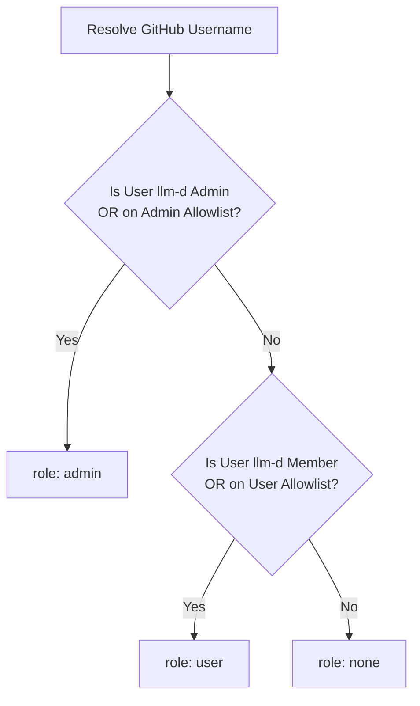

# Prism Identity & Access Management (IAM)

This document describes how Prism validates user identities, manages roles, and
enforces access control permissions.

---

## 1. Authentication Flow

Prism uses GitHub OAuth for user authentication. When a user logs in, they
authorize the Prism GitHub App, which issues an access token.

1. **Token Verification**:
   - The client includes the token in the `X-Prism-Github-Token` header for
     request authorization.
   - The backend queries `GET https://api.github.com/user` to verify the token's
     validity and retrieve the authenticated user's GitHub username.

---

## 2. Authorization & Role Resolution

Once a user's GitHub username is resolved, Prism checks their permissions across
multiple sources (GitHub organization role and GCS allowlists) and assigns the
highest resolved `PermissionLevel` (`admin` > `user` > `none`).



### 2.1 GitHub Organization Membership (Primary)

Prism first attempts to verify organization membership and role within the
`llm-d` GitHub organization.

- **Admin role**: Users with the `"admin"` role and an `"active"` membership
  state in the `llm-d` organization are granted `admin` permissions on Prism.
- **User role**: Users with the `"member"` role and an `"active"` membership
  state in the `llm-d` organization are granted standard `user` permissions on
  Prism.

### 2.2 GCS-Based Allowlists (Fallback / Closed Beta Override)

If the user is not found in the `llm-d` GitHub organization (or the organization
lookup fails/returns non-active status), the backend falls back to verifying the
user against allowlist text files stored in Google Cloud Storage (GCS). These
files contain line-separated GitHub usernames.

Depending on the environment configuration, these allowlist files are read from
the following GCS paths:

- **Local Development / Staging Mode** (when `llm-d-benchmarks-staging` is
  present in `DEFAULT_BUCKETS`):
  - **User Allowlist**:
    `gs://llm-d-benchmarks-staging/prism-iam/github-user-allowlist.txt`
  - **Admin Allowlist**:
    `gs://llm-d-benchmarks-staging/prism-iam/github-admin-allowlist.txt`
- **Production Mode**:
  - **User Allowlist**:
    `gs://llm-d-benchmarks/prism-iam/github-user-allowlist.txt`
  - **Admin Allowlist**:
    `gs://llm-d-benchmarks/prism-iam/github-admin-allowlist.txt`

---

## 3. Managing Allowlists with `prism-iam`

Administrators can manage the GCS-based allowlists using the CLI helper tool
`tools/prism-iam`.

### 3.1 Command Usage

```bash
# Manage a specific allowlist
./tools/prism-iam <user-allowlist|admin-allowlist> <production|staging> <edit|list|add|remove> [username]

# Summarize allowlists
./tools/prism-iam summarize [production|staging]
```

### 3.2 Actions

- **`list`**: Prints all usernames currently present in the selected GCS
  allowlist to stdout.
- **`edit`**: Fetches the GCS allowlist, opens it in the local `$EDITOR`
  (defaults to `vi`), and uploads the updated list back to GCS upon exit if
  changes were detected. **To prevent accidental lockouts, the command will
  abort and fail fatally if the file is left empty after editing.**
- **`add <username>`**: Appends a new username to the allowlist. It errors out
  if the username is already in the list.
- **`remove <username>`**: Removes the specified username from the allowlist. It
  errors out if the username is not found.
- **`summarize`**: Prints a clean YAML-like summary of all users and admins
  across the specified environment(s).
